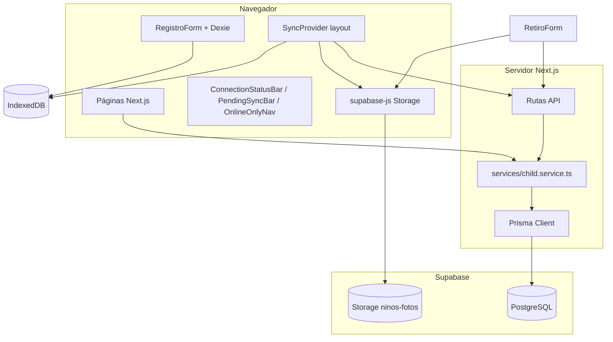

# Arquitectura

## Propósito

Plataforma humanitaria para el **reencuentro familiar** de niños tras emergencia sísmica en Venezuela. Permite que rescatistas registren niños en campo (con o sin internet) y que familias los busquen por ubicación, edad o nombre sin exponer identidad en público.

## Stack

| Capa | Tecnología |
|------|------------|
| Frontend | Next.js 16 (App Router), React 19, TypeScript |
| UI | shadcn/ui, Tailwind CSS 4, next-themes |
| Base de datos | PostgreSQL en Supabase vía **Prisma 7** (`@prisma/adapter-pg`) |
| Archivos | Supabase Storage (bucket `ninos-fotos`) |
| Offline | Dexie (IndexedDB) en `/registro`; fotos como `foto_data` (ArrayBuffer) |
| PWA | `manifest.json` + `public/sw.js` v3 (precache `/`, `/registro`) |

## Diagrama de capas



## Estructura del código

```
src/
├── app/                    # Rutas App Router
│   ├── page.tsx            # Landing
│   ├── registro/           # Formulario offline-first
│   ├── tablero/            # Niños con vida (Buscando)
│   ├── fallecidos/         # Niños fallecidos (Buscando)
│   ├── ninos/[id]/         # Ficha pública
│   └── api/ninos/          # Endpoints HTTP
├── components/
│   ├── RegistroForm.tsx
│   ├── ChildCard.tsx       # Tarjeta; sin foto real si fallecido
│   ├── SinFotoPlaceholder.tsx
│   ├── SyncProvider.tsx    # Sync global en layout
│   ├── ConnectionStatusBar.tsx
│   ├── PendingSyncBar.tsx
│   ├── OfflineNavProvider.tsx
│   ├── OnlineOnlyNav.tsx
│   └── OfflinePrecache.tsx
├── services/               # Lógica de negocio + Prisma
│   ├── child.service.ts
│   └── errors.ts
├── hooks/
│   ├── useOnlineStatus.ts
│   └── usePendingSyncCount.ts
├── lib/
│   ├── prisma.ts
│   ├── db.ts               # Dexie
│   ├── sync.ts             # Offline → Storage → API
│   ├── childPhoto.ts       # Resolver Blob desde Dexie
│   ├── offlineRoutes.ts    # Rutas offline vs online-only
│   ├── withTimeout.ts      # Timeout en subidas Storage
│   ├── supabaseStorage.ts
│   ├── tablero.ts
│   ├── publicChild.ts
│   └── types.ts
└── data/venezuela.json
```

## Prisma y Supabase: dos servicios, un proyecto

Supabase no es un ORM alternativo a Prisma. En este proyecto cumplen roles distintos:

| Servicio Supabase | Uso en la app | Conexión |
|-------------------|---------------|----------|
| **PostgreSQL** | Modelo `Child`, consultas del tablero, API | Prisma con `DATABASE_URL` (puerto **6543**, pooler) |
| **Storage** | Fotos del niño (solo con vida) y del retiro | Cliente JS en el navegador con clave anónima |

- **Migraciones**: CLI de Prisma con `DIRECT_URL` (puerto **5432**) definida en `prisma.config.ts`.
- **Runtime**: `src/lib/prisma.ts` usa adapter `pg` + `DATABASE_URL`.
- **No se usa**: Supabase Auth, Realtime ni Edge Functions.

## Capa de servicios

Toda petición a Prisma pasa por `src/services/child.service.ts`:

| Función | Descripción |
|---------|-------------|
| `listTableroChildren` | Listado paginado con filtros |
| `getPublicChildById` | Ficha sin campos de identidad del niño |
| `upsertChild` | Crear/actualizar desde sync |
| `registerChildRetiro` | Entrega con validaciones |

`assertValidChildPayload` exige campos mínimos incluyendo `rasgos_particulares`.

## Modelo de datos (resumen)

Ver `prisma/schema.prisma`. Campos clave:

- **`status`**: `Buscando` \| `Reencontrado`
- **`estado_vital`**: `ConVida` \| `Fallecido`
- **`fullname`**, **`nombre_padre`**, etc.: guardados para búsqueda interna, no expuestos en UI pública
- **`rasgos_particulares`**: obligatorio al registrar; visible en ficha pública
- **Foto del niño**: solo niños con vida; fallecidos sin `foto_url` en UI
- **Retiro**: datos y tres URLs de foto (`cedula`, `persona`, `parentesco`)

## Documentación de flujos

- [Conexión y offline](./flujos/conexion-y-offline.md)
- [Registro y sincronización](./flujos/registro-y-sincronizacion.md)
- [Fallecidos](./flujos/fallecidos.md)
