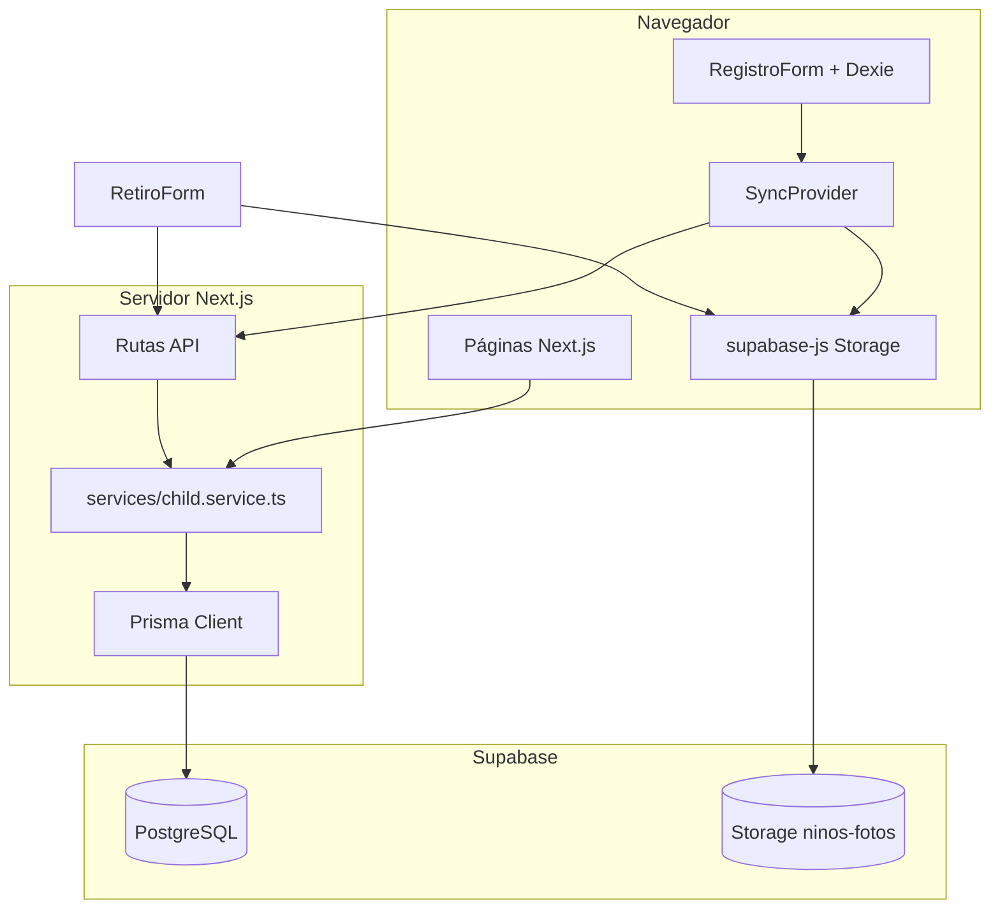

# Arquitectura

## Propósito

Plataforma humanitaria para el **reencuentro familiar** de niños tras emergencia sísmica en Venezuela. Permite que rescatistas registren niños en campo (con o sin internet) y que familias los busquen por ubicación, edad o nombre sin exponer identidad en público.

## Stack

| Capa | Tecnología |
|------|------------|
| Frontend | Next.js 16 (App Router), React 19, TypeScript |
| UI | shadcn/ui, Tailwind CSS 4, next-themes |
| Base de datos | PostgreSQL en Supabase vía **Prisma 7** (`@prisma/adapter-pg`) |
| Archivos | Supabase Storage (bucket `ninos-fotos`) |
| Offline | Dexie (IndexedDB) solo en `/registro` |
| PWA | `manifest.json` + service worker mínimo (`public/sw.js`) |

## Diagrama de capas



## Estructura del código

```
src/
├── app/                    # Rutas App Router
│   ├── page.tsx            # Landing + banner PWA
│   ├── registro/           # Formulario offline-first
│   ├── tablero/            # Niños con vida (Buscando)
│   ├── fallecidos/         # Niños fallecidos (Buscando)
│   ├── ninos/[id]/         # Ficha pública + retiro
│   └── api/ninos/          # Endpoints HTTP
├── components/             # UI reutilizable
├── services/               # Lógica de negocio + Prisma
│   ├── child.service.ts
│   └── errors.ts
├── lib/
│   ├── prisma.ts           # Cliente Prisma (pooler)
│   ├── db.ts               # Dexie / IndexedDB
│   ├── sync.ts             # Sincronización offline → servidor
│   ├── supabaseStorage.ts  # Subida de fotos
│   ├── tablero.ts          # Filtros y paginación del tablero
│   ├── publicChild.ts      # Selects que excluyen datos sensibles
│   └── types.ts            # Tipos compartidos cliente/servidor
└── data/venezuela.json     # Estados y municipios
```

## Prisma y Supabase: dos servicios, un proyecto

Supabase no es un ORM alternativo a Prisma. En este proyecto cumplen roles distintos:

| Servicio Supabase | Uso en la app | Conexión |
|-------------------|---------------|----------|
| **PostgreSQL** | Modelo `Child`, consultas del tablero, API | Prisma con `DATABASE_URL` (puerto **6543**, pooler) |
| **Storage** | Fotos del niño y del retiro | Cliente JS en el navegador con clave anónima |

- **Migraciones**: CLI de Prisma con `DIRECT_URL` (puerto **5432**) definida en `prisma.config.ts`.
- **Runtime**: `src/lib/prisma.ts` usa adapter `pg` + `DATABASE_URL`.
- **No se usa**: Supabase Auth, Realtime ni Edge Functions.

## Capa de servicios

Toda petición a Prisma pasa por `src/services/child.service.ts`:

| Función | Descripción |
|---------|-------------|
| `listTableroChildren` | Listado paginado con filtros |
| `getPublicChildById` | Ficha sin campos de identidad del niño |
| `upsertChild` | Crear/actualizar desde sync |
| `registerChildRetiro` | Entrega con validaciones |

Las rutas API y las páginas servidor solo delegan; no llaman a `prisma` directamente.

## Modelo de datos (resumen)

Ver `prisma/schema.prisma`. Campos clave:

- **`status`**: `Buscando` \| `Reencontrado`
- **`estado_vital`**: `ConVida` \| `Fallecido`
- **`fullname`**, **`nombre_padre`**, etc.: guardados para búsqueda interna, no expuestos en UI pública
- **Retiro**: datos y tres URLs de foto (`cedula`, `persona`, `parentesco`)
