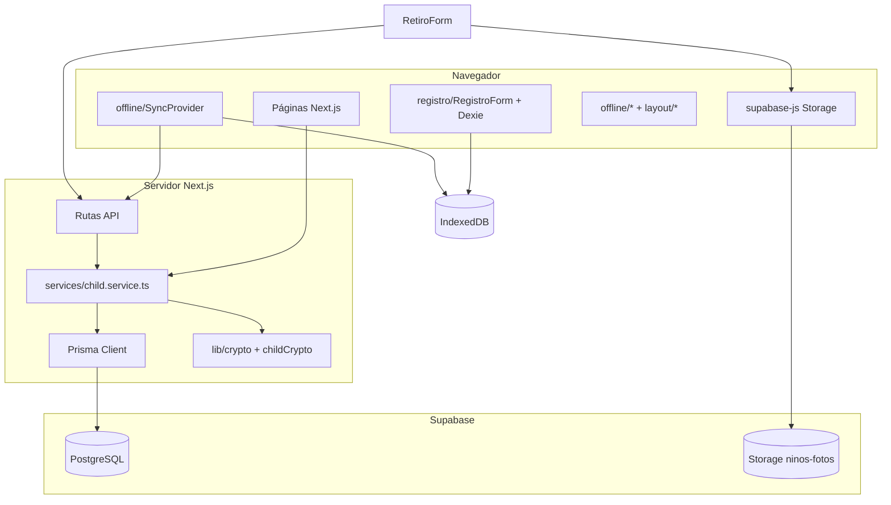

# Arquitectura

## Propósito

Plataforma humanitaria para el **reencuentro familiar** de niños, niñas y adolescentes tras emergencia sísmica en Venezuela. Permite que rescatistas registren en campo (con o sin internet) y que familias los busquen por ubicación, edad o nombre sin exponer identidad en público.

## Stack

| Capa | Tecnología |
|------|------------|
| Frontend | Next.js 16 (App Router), React 19, TypeScript |
| UI | shadcn/ui, Tailwind CSS 4, next-themes |
| Formularios | react-hook-form + Zod |
| Base de datos | PostgreSQL en Supabase vía **Prisma 7** (`@prisma/adapter-pg`) |
| Archivos | Supabase Storage (fotos de retiro; cifradas con `AUTH_SECRET`) |
| Offline | Dexie (IndexedDB) en `/registro` |
| PWA | `manifest.json` + `public/sw.js` v4 (precache `/`, `/registro`) |

## Diagrama de capas



## Estructura del código

```
src/
├── app/                         # Rutas App Router y API
│   ├── page.tsx                 # /
│   ├── registro/
│   ├── tablero/
│   ├── fallecidos/
│   ├── ninos/[id]/
│   └── api/
├── components/
│   ├── ui/                      # shadcn (Button, Input, Card…)
│   ├── layout/                  # AppHeader, SiteFooter, ThemeProvider
│   ├── shared/                  # EntregaSeguraNotice (/, /ninos/[id])
│   ├── registro/                # RegistroForm, EstadoCiudadSelect
│   ├── tablero/                 # ChildCard, TableroPageContent, filtros…
│   ├── ninos/                   # RetiroForm, SinFotoPlaceholder
│   ├── offline/                 # SyncProvider, barras, navegación offline
│   └── pwa/                     # Instalación PWA
├── types/                       # Interfaces y tipos compartidos
│   ├── child.ts                 # LocalChild, ChildPayload, RetiroPayload
│   ├── public-child.ts          # PublicChildCard, PublicChildDetail
│   ├── tablero.ts               # TableroSearchParams, filtros
│   ├── registro.ts              # RegistroFormValues (re-export)
│   ├── edad.ts                  # parseEdadRegistro, formatEdadEstimada
│   └── index.ts                 # Barrel
├── hooks/
│   ├── useOnlineStatus.ts
│   └── usePendingSyncCount.ts
├── services/                    # Lógica de negocio + Prisma
│   ├── child.service.ts
│   └── errors.ts
├── lib/                         # Utilidades (sin tipos sueltos)
│   ├── prisma.ts, db.ts, sync.ts
│   ├── crypto.ts, childCrypto.ts
│   ├── registroSchema.ts        # Zod del formulario de registro
│   ├── tablero.ts, publicChild.ts, edad.ts
│   └── storageUrl.ts, offlineRoutes.ts
└── data/venezuela.json
```

### Convenciones de importación

| Qué importar | Desde |
|--------------|-------|
| Tipos de dominio | `@/types` o `@/types/child` |
| Componentes de ruta | `@/components/registro/RegistroForm` |
| UI genérica | `@/components/ui/*` |
| Lógica servidor | `@/services/*` |
| Utilidades | `@/lib/*` |

## Prisma y Supabase

| Servicio Supabase | Uso en la app |
|-------------------|---------------|
| **PostgreSQL** | Modelo `Child`, tablero, API |
| **Storage** | Fotos de retiro (cifradas; servidas vía `/api/media`) |

- **Migraciones**: Prisma con `DIRECT_URL` (puerto 5432).
- **Runtime**: `src/lib/prisma.ts` con adapter `pg`.
- **Cifrado**: campos sensibles con AES-256-GCM (`AUTH_SECRET`); búsqueda por nombre con tokens HMAC.

## Capa de servicios

Toda petición a Prisma pasa por `src/services/child.service.ts`:

| Función | Descripción |
|---------|-------------|
| `listTableroChildren` | Listado paginado con filtros |
| `getPublicChildById` | Ficha sin datos de identidad |
| `upsertChild` | Crear/actualizar desde sync |
| `registerChildRetiro` | Entrega con validaciones |

## Modelo de datos (resumen)

Ver `prisma/schema.prisma`. Campos clave:

- **`status`**: `Buscando` \| `Reencontrado`
- **`estado_vital`**: `ConVida` \| `Fallecido`
- **Nombres de la persona registrada y familiares**: cifrados en BD; búsqueda por tokens; no en UI pública
- **`rasgos_particulares`**: obligatorio; visible en tablero y ficha
- **Sin fotos de menores** en la plataforma (LOPNNA)
- **Retiro**: campos y fotos de adultos reservados para entrega segura futura

## Documentación de flujos

- [Conexión y offline](./flujos/conexion-y-offline.md)
- [Registro y sincronización](./flujos/registro-y-sincronizacion.md)
- [Fallecidos](./flujos/fallecidos.md)
