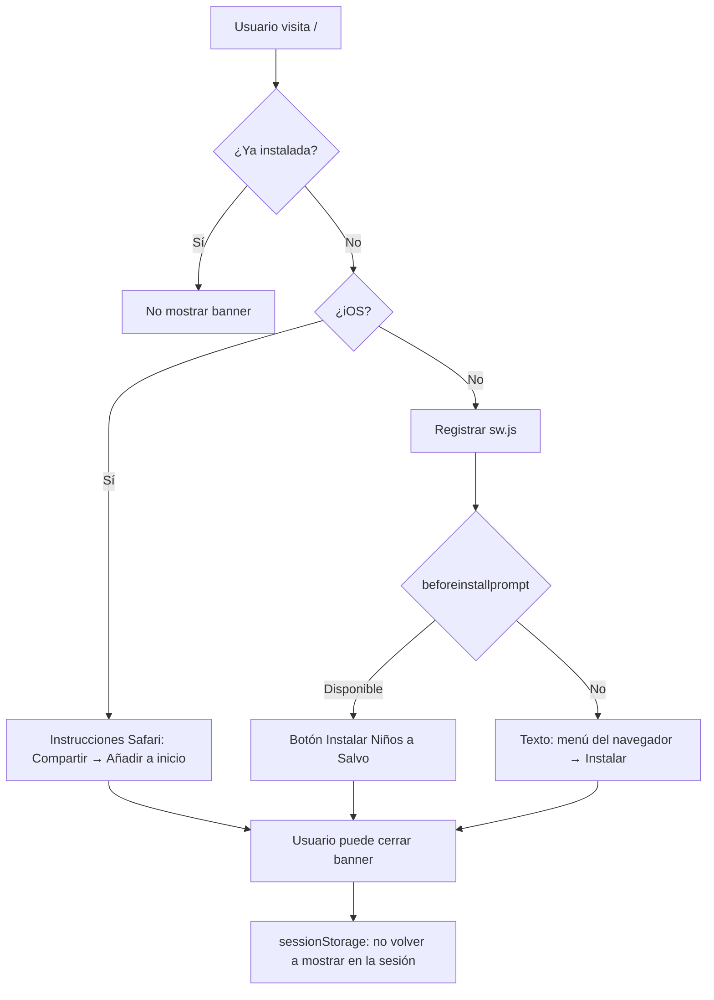

# Flujo: PWA e instalación

**Ruta:** `/`  
**Componente:** `PwaInstallPrompt`

## Objetivo

Facilitar el acceso desde la pantalla de inicio del dispositivo, útil para rescatistas en campo con conexión limitada.

## Comportamiento

## Archivos

| Archivo | Rol |
|---------|-----|
| `public/manifest.json` | Nombre, iconos, `display: standalone` |
| `public/sw.js` | Service worker mínimo (habilita instalación; sin caché offline de rutas) |
| `src/components/PwaInstallPrompt.tsx` | UI del banner |
| `src/app/layout.tsx` | Enlaza `manifest` en metadata |

## Alcance offline

La PWA **no** cachea el tablero ni las fichas. El modo offline real solo aplica al **registro** (`/registro`) vía Dexie. Ver [Registro y sincronización](./registro-y-sincronizacion.md).
