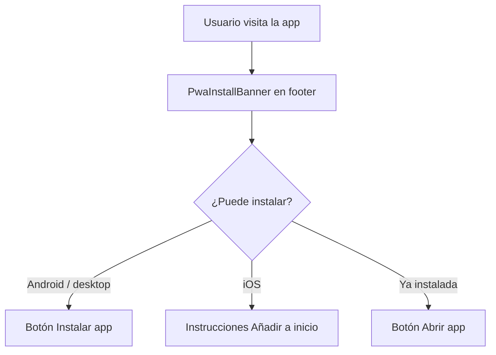

# Flujo: PWA e instalación

**Rutas:** `/` (banner en pie de página vía `SiteFooter`)  
**Componentes:** `PwaInstallBanner`, `PwaInstallButton`, `PwaInstallProvider`, `OfflinePrecache`

## Objetivo

Facilitar el acceso desde la pantalla de inicio del dispositivo, útil para rescatistas en campo con conexión limitada.

## Comportamiento

El banner de instalación permanece visible en el pie de página para facilitar la instalación en puntos de resguardo.

## Archivos

| Archivo | Rol |
|---------|-----|
| `public/manifest.json` | Nombre, iconos, `display: standalone` |
| `public/sw.js` | Service worker v3: precache `/` y `/registro`, runtime cache, fallback offline |
| `public/icons/` | Iconos PWA (`npm run icons:pwa`) |
| `src/components/PwaInstall*.tsx` | Banner, botón y provider de instalación |
| `src/components/OfflinePrecache.tsx` | Registro SW y prefetch de rutas offline |
| `src/app/layout.tsx` | Metadata `manifest`, barras de conexión y sync global |

## Alcance offline

| Ruta | Offline |
|------|---------|
| `/` | Sí (shell precacheado) |
| `/registro` | Sí (formulario + Dexie) |
| `/tablero`, `/fallecidos`, `/ninos/[id]` | No (requieren servidor) |

El registro guarda datos y fotos en IndexedDB; la sincronización a Supabase ocurre al recuperar red. Ver [Registro y sincronización](./registro-y-sincronizacion.md) y [Conexión y offline](./conexion-y-offline.md).
