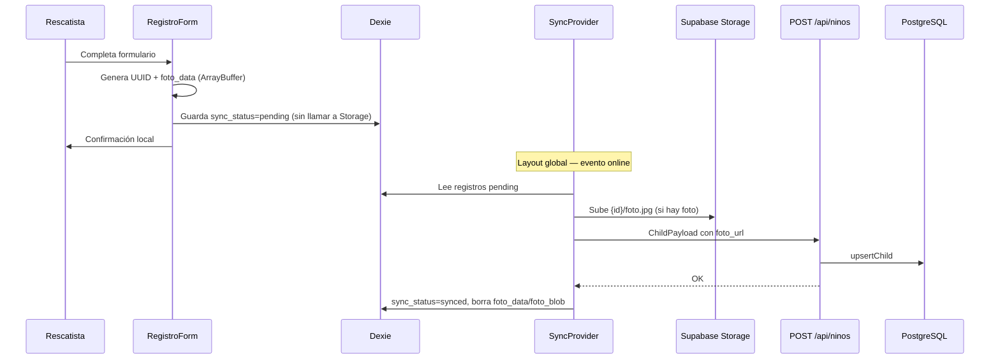

# Flujo: Registro offline y sincronización

**Ruta:** `/registro`  
**Componentes:** `RegistroForm`, `SyncProvider` (layout global)  
**Almacenamiento local:** Dexie (`src/lib/db.ts`)  
**Sincronización:** `src/lib/sync.ts`, `src/lib/childPhoto.ts`

## Objetivo

Permitir registrar un niño (con vida o fallecido) **sin conexión**, conservar la foto en el dispositivo y subir todo al volver online.

## Diagrama

## Pasos del registro

1. **Condición del niño** (primero): **Con vida** o **Fallecido**.
2. **Foto**:
   - **Con vida:** obligatoria; se comprime en cliente (`compressImage`).
   - **Fallecido:** no se solicita ni se sube. Mensaje amable pidiendo no adjuntar imágenes.
3. **Datos del niño:**
   - **Rasgos particulares:** siempre **obligatorios** (todos los casos).
   - **Con vida — datos desconocidos:** checkbox «El niño no puede hablar / datos desconocidos»; genera ID temporal; nombre opcional.
   - **Fallecido — ¿Se conocen los datos?:** checkbox «No se conocen sus datos»; nombre opcional si está marcado.
4. Ubicación (estado, municipio, resguardo, descripción).
5. Informante (nombre y teléfono).
6. Guardado en IndexedDB con `id` UUID y `foto_data` (ArrayBuffer) cuando hay foto.

## Persistencia de la foto offline

| Campo Dexie | Uso |
|-------------|-----|
| `foto_data` | `ArrayBuffer` de la imagen (persistencia fiable en IndexedDB) |
| `foto_mime` | Tipo MIME (p. ej. `image/jpeg`) |
| `foto_blob` | Legacy; la sync usa `resolveChildPhotoBlob()` que lee blob o buffer |

Al guardar **no** se llama a Supabase. La subida ocurre solo en `sync.ts` cuando hay red.

## Sincronización

- `SyncProvider` en `layout.tsx`: al montar y en `window.online` → `triggerSync()`.
- Por cada registro `pending`:
  1. Comprueba `navigator.onLine`.
  2. Sube foto a Storage (`{id}/foto.jpg`) con timeout de 25 s.
  3. `POST /api/ninos` con upsert por `id` (incluye `rasgos_particulares` obligatorio en API).
  4. Marca `synced` y elimina datos locales de la foto.

Si la subida falla o hay timeout, el registro permanece `pending` para reintentar al reconectar.

## Validación en servidor

`assertValidChildPayload` exige, entre otros: `rasgos_particulares` no vacío.

## Qué no es offline

- **Retiro** del niño: requiere conexión (tres fotos + API).
- **Tablero / fallecidos / ficha**: leen del servidor vía Prisma.

## Redirección tras guardar

| Red | `estado_vital` | Destino |
|-----|----------------|---------|
| Sin conexión | Cualquiera | `/` |
| Con conexión | `Fallecido` | `/fallecidos` |
| Con conexión | `ConVida` | `/tablero` |

Mensaje de éxito offline: el registro y la foto quedan en el dispositivo hasta recuperar internet.

## Relacionado

- [Conexión y rutas offline](./conexion-y-offline.md) — barras UI, navegación bloqueada, contador de pendientes.
- [Fallecidos](./fallecidos.md) — registro y visualización sin fotografía.
