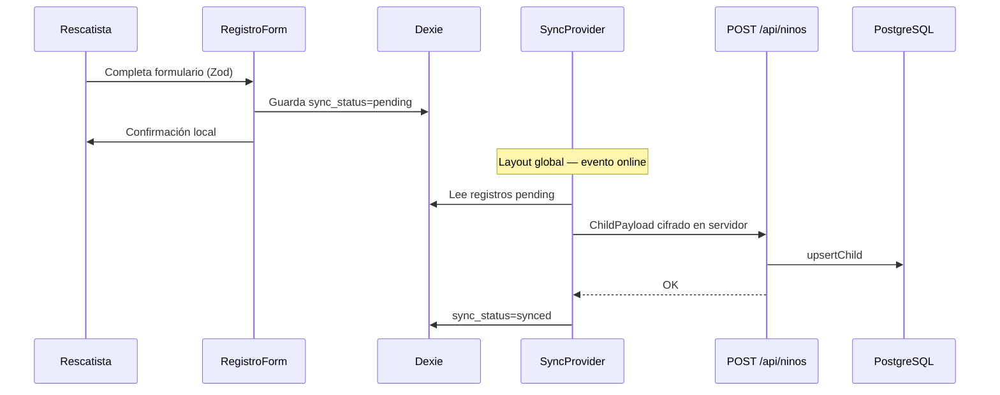

# Flujo: Registro offline y sincronización

**Ruta:** `/registro`  
**Componentes:** `components/registro/RegistroForm`, `components/offline/SyncProvider`  
**Validación:** `lib/registroSchema.ts` (Zod) + react-hook-form  
**Almacenamiento local:** Dexie (`src/lib/db.ts`)  
**Sincronización:** `src/lib/sync.ts`

## Objetivo

Permitir registrar a un niño, niña o adolescente (con vida o fallecido) **sin conexión**, validar datos en cliente y sincronizar al volver online.

## Diagrama

## Pasos del registro

1. **Condición** (primero): **Con vida** o **Fallecido**.
2. **Sin fotografías** de menores (LOPNNA): solo descripción en rasgos.
3. **Datos de la persona registrada:**
   - **Edad:** años enteros (0–120); 0 = menor de 1 año (0–12 meses).
   - **Nombres:** sin dígitos; validación Zod.
   - **Rasgos particulares:** obligatorios, con ejemplo en placeholder.
   - Datos desconocidos: ver [Fallecidos](./fallecidos.md).
4. Ubicación e informante (teléfono 10–11 dígitos).
5. Guardado en IndexedDB con UUID.

## Sincronización

- `SyncProvider` en `layout.tsx`: al montar y en `window.online` → `triggerSync()`.
- Por cada registro `pending`: `POST /api/ninos` con upsert por `id`.
- El servidor cifra campos sensibles antes de persistir.

## Validación

| Capa | Archivo |
|------|---------|
| Cliente | `src/lib/registroSchema.ts` + `components/registro/RegistroForm.tsx` |
| Servidor | `assertValidChildPayload` en `services/child.service.ts` |

## Qué no es offline

- **Retiro**: requiere conexión.
- **Tablero / fallecidos / ficha**: leen del servidor.

## Redirección tras guardar

| Red | `estado_vital` | Destino |
|-----|----------------|---------|
| Sin conexión | Cualquiera | `/` |
| Con conexión | `Fallecido` | `/fallecidos` |
| Con conexión | `ConVida` | `/tablero` |

## Relacionado

- [Conexión y rutas offline](./conexion-y-offline.md)
- [Fallecidos](./fallecidos.md)
