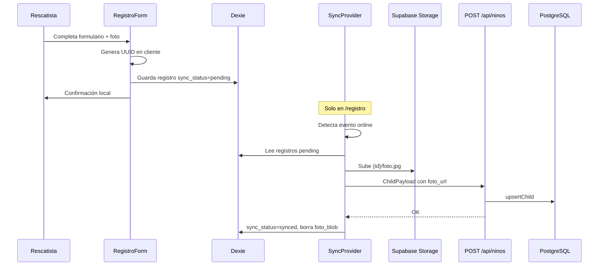

# Flujo: Registro offline y sincronización

**Ruta:** `/registro`  
**Componentes:** `RegistroForm`, `SyncProvider`  
**Almacenamiento local:** Dexie (`src/lib/db.ts`)  
**Sincronización:** `src/lib/sync.ts`

## Objetivo

Permitir registrar un niño (con vida o fallecido) **sin conexión** y subir los datos al volver online.

## Diagrama

## Pasos del registro

1. Datos del niño: nombre (opcional si «datos desconocidos»), edad, rasgos, ubicación en Venezuela.
2. Estado vital: **Con vida** o **Fallecido** (define si aparece en `/tablero` o `/fallecidos`).
3. Foto obligatoria (comprimida en cliente).
4. Datos del informante (nombre y teléfono).
5. Guardado en IndexedDB con `id` UUID generado en el navegador.

## Sincronización

- `SyncProvider` envuelve solo la página `/registro`.
- Al montar y al evento `window.online`, llama `triggerSync()`.
- Por cada registro `pending`:
  1. Sube `foto_blob` a Storage.
  2. `POST /api/ninos` con upsert por `id`.
  3. Marca `synced` y elimina el blob local.

## Qué no es offline

- **Retiro** del niño: requiere conexión (tres fotos + API).
- **Tablero / fallecidos / ficha**: siempre leen del servidor vía Prisma.

## Redirección tras guardar

- `estado_vital === Fallecido` → `/fallecidos`
- `estado_vital === ConVida` → `/tablero`
