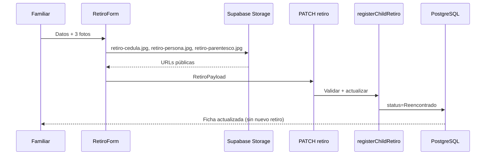

# Flujo: Retiro seguro

**Ruta:** `/ninos/[id]` (solo `ConVida` y `Buscando`)  
**Componente:** `RetiroForm`  
**API:** `PATCH /api/ninos/[id]/retiro`  
**Servicio:** `registerChildRetiro`

## Objetivo

Registrar la entrega a un familiar o tutor legítimo y **bloquear** el registro para evitar entregas fraudulentas.

## Requisitos

### Datos de texto

- Cédula de quien retira
- Nombre completo
- Parentesco
- Teléfono

### Tres fotos obligatorias

1. **Cédula** — documento legible
2. **Persona** — rostro de quien retira
3. **Parentesco** — acta, partida u otro documento que acredite el vínculo

## Secuencia

## Validaciones del servicio

| Error | HTTP | Condición |
|-------|------|-----------|
| `InvalidRetiroPayloadError` | 400 | Campo vacío |
| `ChildNotFoundError` | 404 | ID inexistente |
| `ChildAlreadyDeliveredError` | 409 | Ya `Reencontrado` |

## Tras el retiro

- El registro **desaparece** del tablero (`status` ya no es `Buscando`).
- La ficha muestra el bloque «Reencuentro familiar» con auditoría del retiro.
- No se puede volver a registrar retiro.

## Offline

Este flujo **no** funciona sin internet: las fotos se suben directamente desde el navegador a Storage.
